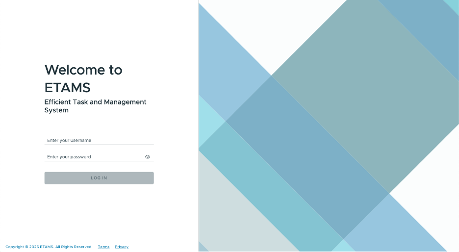
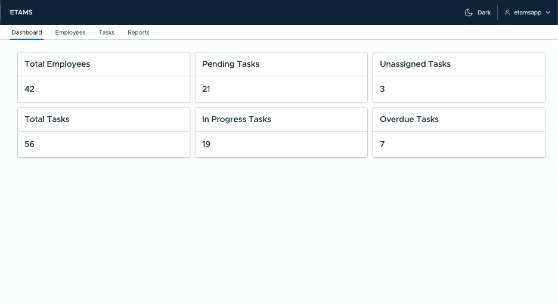
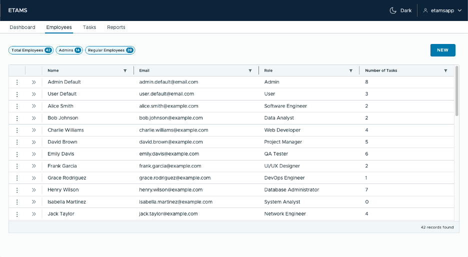
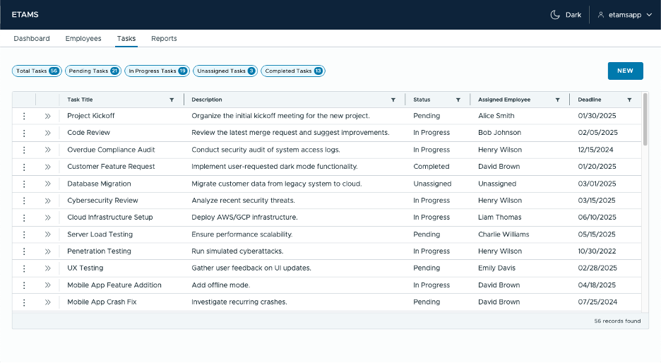
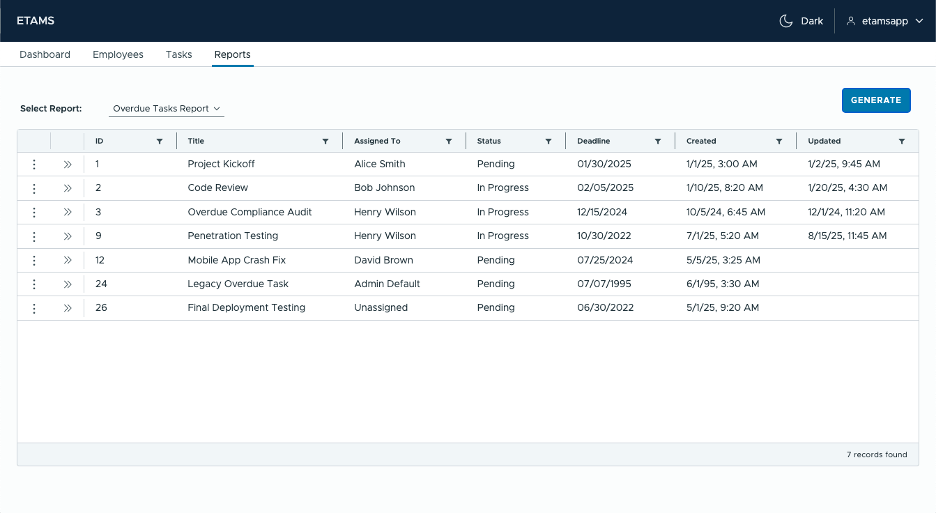

# Employee Task and Assignment Management System (ETAMS)

_A Full Stack Employee Task Management System_

## Table of Contents
- [Overview](#overview)
- [Features](#features)
- [Tech Stack](#tech-stack)
- [Project Structure](#project-structure)
- [Installation & Setup](#installation--setup)
- [Usage](#usage)
- [API Endpoints](#api-endpoints)
- [Screenshots](#screenshots)
- [Contact](#contact)

---
## Overview

ETAMS (Employee Task and Management System) is a full-stack web application designed to streamline task assignment and management for teams. It provides a dashboard for admins to oversee employees and tasks, while non-admin users can track and manage their assigned work. ETAMS was developed as part of my capstone project to demonstrate my ability to build scalable and secure enterprise applications.

---

## Features

The features of ETAMS includes:

- User authentication with role-based access control (admin vs. employee)
- Task creation, assignment, and status tracking 
- Employee management (CRUD operations)
- Dynamic reporting for performance insights 
- JWT-based authentication and authorization 
- RESTful API for backend communication

---

## Tech Stack

Frontend:
- Angular 19

Backend:
- Spring Boot 3.4.1
- Custom API
- Spring Security
- JPA & Hibernate

Database:
- MySQL (development)
- MariaDB (production)

Deployment:
- Docker & Docker Compose
- Nginx reverse proxy

---

## Project Structure

```
/etams
  ├── backend/                   # Spring Boot backend
  │   ├── src/main/java/com/brubaker/etams/
  │   ├── src/test/java/com/brubaker/etams/
  │   ├── pom.xml                # Maven dependencies
  │   └── Dockerfile
  ├── db-init/
  │   └──  init-db.sql           # Database initialization & reset script
  ├── docker/                    # Docker Compose
  ├── Documentation/             # Various documentation created during the development process
  ├── frontend/                  # Angular frontend
  │   ├── src/app/
  │   ├── src/environments/
  │   ├── angular.json
  │   └── Dockerfile
  ├── nginx/                     # Nginx configurations
  └── README.md                  # Me!
```

---

## Installation & Setup

### Prerequisites
- Docker & Docker Compose
- Java 21+ (if running backend manually)
- Node.js 22+ (if running frontend manually)
- MySQL (if not using Docker)

### Setup
```shell
# Clone the repository
git clone https://github.com/brubakerjm/etams.git

# Start with Docker
cd etams/docker
docker compose up --build

# Alternatively, start backend manually
cd etams/backend
mvn spring-boot:run

# Start frontend manually
cd etams/frontend
npm install
ng serve --open
```

### Accessing the Frontend
- Docker:

`http://localhost:8000`

- Started manually:

`http://localhost:4200`

---

## Usage

This section provides a high-level overivew of how to use ETAMS. For a detailed step-by-step guide, refer to the [User Manual](fixme).

### Default User Credentials 
Admin Account
- etamsapp
- etamsapp

Non-Admin Account
- etamsuser
- etamsapp

### Logging In
1. Navigate to the ETAMS Login Page. 
2. Enter your username and password. 
3. Click Login to access the system.

### Admin Users
Admin users have access to:
- Dashboard: View business metrics and quick insights. 
- Employees: Add, edit, or delete employee records. 
- Tasks: Create, assign, update, and delete tasks. 
- Reports: Generate reports for task tracking.

Creating Employees 
Navigate to the Employees section. 
2. Click New. 
3. Enter employee details (first name, last name, email, etc.). 
4. Click Save.

Creating Tasks
1. Navigate to the Tasks section.
2. Click New. 
3. Enter task details (title, description, deadline, etc.). 
4. Assign an employee or leave unassigned. 
5. Click Save.

### Non-Admin Users
Non-Admin users have access to:
- View Assigned Tasks: Employees can see their assigned tasks.
- Task Updates: Employees can update task statuses and details.
- Reports: Generate reports for task tracking.

### Generating Reports
1. Go to the Reports section. 
2. Select report type (Overdue Tasks Report or Task Activty Report).
3. Enter data range or leave blank (Task Activity Report). 
4. Click Generate Report.

For detailed instructions for the ETAMS application, please refer to the [User Manual](fixme).

---

### API Endpoints

To view the API endpoints implemented in ETAMS, visit the Swagger UI page with the ETAMS application running:

`http://localhost:8080/swagger-ui/index.html#/`

---

### Screenshots







---

### Contact

* **Author:** Jacob Brubaker
* **Email:** brubakerjm@gmail.com
* **LinkedIn:** linkedin.com/in/jacob-brubaker/
* **GitHub:** github.com/brubakerjm


